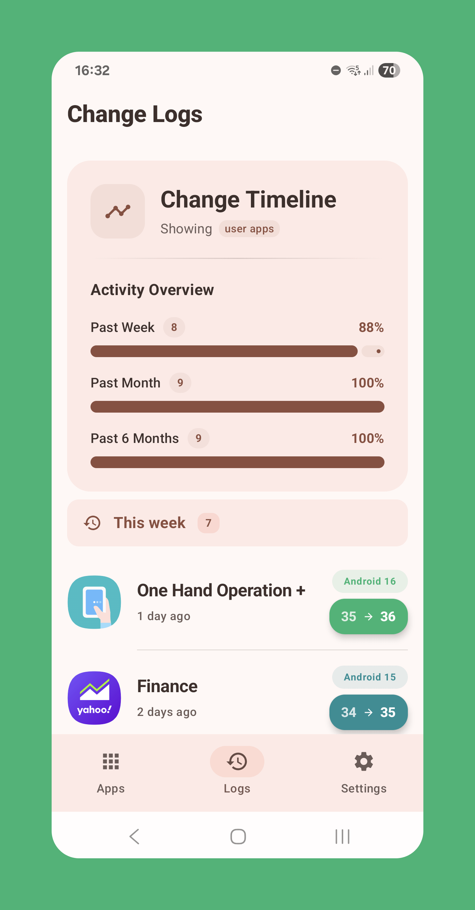
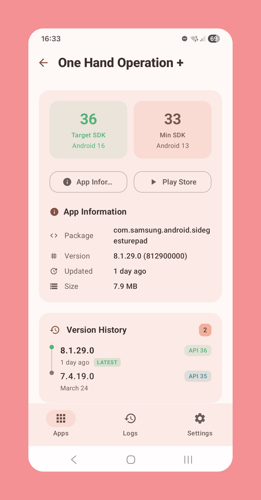

# SDK Monitor

[](https://android-arsenal.com/api?level=24)
[](https://kotlinlang.org)
[](https://opensource.org/licenses/Apache-2.0)
[](https://f-droid.org/packages/com.bernaferrari.sdkmonitor/)

**SDK Monitor** shows you which Android API levels your installed apps are targeting. Since 2017 Google requires apps to target recent API levels for better security and privacy, this tool helps you see how up-to-date your apps really are.


## 📱 Get it

[](https://f-droid.org/packages/com.bernaferrari.sdkmonitor/)

[Download from GitHub](https://github.com/bernaferrari/SDKMonitor/releases/latest)

## 📸 Screenshots

|       Home Screen        |             Logs              |          App Details           |             Settings             |
| :----------------------: |:-----------------------------:|:------------------------------:| :------------------------------: |
|  |  |  |  |

## Why does this matter?

Newer Android versions come with better security and privacy features. When apps target recent API levels, they're forced to use these improvements. But Android doesn't show you this information by default, so SDK Monitor makes it visible. It also helps you see which apps are updating because they have to, versus those that genuinely want to improve.

## ✨ Features

### What it does

- **SDK Analysis** - See targetSDK versions for all your apps
- **Visual Charts** - Nice graphs showing how your apps are distributed
- **Search & Filter** - Find apps quickly with live search
- **App Details** - Full info including permissions and install dates
- **Background Updates** - Automatically tracks changes when you install or update apps

### How it works

- **Adaptive Design** - Looks great on phones, tablets, and foldables
- **Material You** - Matches your system colors
- **Fast Scrolling** - Jump through long app lists easily
- **Fully Offline** - No internet required, everything stays on your device

### Languages

English, Italian, French, Portuguese (BR), German, Spanish, Japanese, and Chinese.

## 🏗️ How it's built

### Tech stack

- **Architecture**: Clean Architecture with MVVM
- **UI**: Jetpack Compose with Material 3
- **Database**: Room for storing app data
- **DI**: Hilt for dependency injection
- **Async**: Kotlin Coroutines and Flow
- **Background**: WorkManager for scheduled tasks
- **Navigation**: Compose Navigation with type safety

### What's inside

**Data handling**

- Room database for local storage
- Repository pattern for data access
- Syncs with system when apps change

**User interface**

- Reactive UI with Compose and Flow
- Custom charts built with Canvas
- Responsive layouts for different screen sizes

**App logic**

- Business logic separated into use cases
- Integrates with Android's PackageManager
- Analyzes and categorizes SDK versions

## 🔧 Building from source

### What you need

- Android Studio Hedgehog | 2023.1.1 or newer
- JDK 17+
- Android SDK with API 34+

### Getting started

```bash
git clone https://github.com/bernaferrari/SDKMonitor.git
cd SDKMonitor
./gradlew assembleDebug
```

### Running tests

```bash
./gradlew test
./gradlew connectedAndroidTest
```

## 📊 About SDK versions

Here's what different API levels mean:

- **API 34** (Android 14): Partial photo/video access
- **API 33** (Android 13): Themed app icons, per-app language preferences, notification permission
- **API 32** (Android 12L): Improved large screen support, new splash screen API
- **API 31** (Android 12): Material You, approximate location permission, clipboard access notifications
- **API 30** (Android 11): Scoped storage enforcement, one-time permissions, background location restrictions
- **API 29** (Android 10): Scoped storage (optional), dark theme, gesture navigation
- **API 28** (Android 9): Network security config required, Apache HTTP client removed
- **API 26-27** (Android 8.x): Background execution limits, notification channels, adaptive icons
- **API 24-25** (Android 7.x): File provider requirements, doze mode, multi-window support
- **Below API 24**: Missing modern security and privacy features

Higher API levels mean apps must adopt newer security and privacy protections.

## 🤝 Contributing

Want to help? Check out our [Contributing Guidelines](CONTRIBUTING.md) for:

- Code style
- How to submit changes
- Reporting bugs
- Suggesting features

## 🐛 Need help?

- **Bug reports**: [GitHub Issues](https://github.com/bernaferrari/SDKMonitor/issues)
- **Questions**: [GitHub Discussions](https://github.com/bernaferrari/SDKMonitor/discussions)
- **F-Droid**: [Package page](https://f-droid.org/packages/com.bernaferrari.sdkmonitor/)

## 📄 License

Licensed under Apache 2.0. See [LICENSE](LICENSE) for details.

```
Copyright 2024 Bernardo Ferrari

Licensed under the Apache License, Version 2.0 (the "License");
you may not use this file except in compliance with the License.
You may obtain a copy of the License at

    http://www.apache.org/licenses/LICENSE-2.0

Unless required by applicable law or agreed to in writing, software
distributed under the License is distributed on an "AS IS" BASIS,
WITHOUT WARRANTIES OR CONDITIONS OF ANY KIND, either express or implied.
See the License for the specific language governing permissions and
limitations under the License.
```
