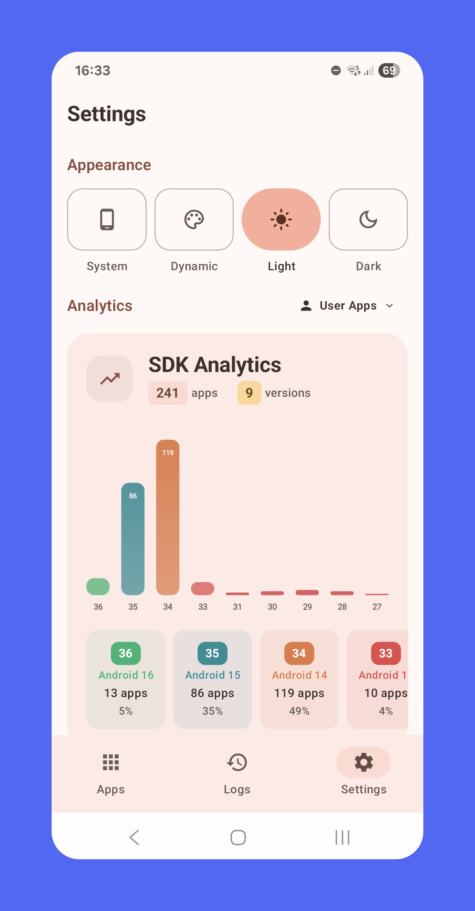

# SDK Monitor

[](https://android-arsenal.com/api?level=24)
[](https://kotlinlang.org)
[](https://opensource.org/licenses/Apache-2.0)
[](https://f-droid.org/packages/com.bernaferrari.sdkmonitor/)

Since 2017, Google's Play Store policy requires apps to target recent Android API levels to ensure
they utilize modern security and privacy features. Because this information isn't available to users
by default, it's difficult to verify which apps are compliant.

SDK Monitor is a simple app that makes this information visible. It scans your installed apps and
displays their Target SDK, helping you see at a glance which applications are up-to-date with
platform standards. Use it to understand how other apps are perfoming in your device.

## ✨ Features

- **📊 Interactive SDK Analytics** - Beautiful charts showing distribution with clickable insights
  and real-time filtering
- **🔍 Smart Search & Filtering** - Real-time search with highlighted results and advanced filtering
  options
- **📱 Universal Design** - Seamlessly adapts to phones, tablets, and foldables with master-detail
  layouts
- **⚡ Intelligent Performance** - Smart caching, smooth scrolling, and responsive interactions
- **🎨 Material You Integration** - Dynamic theming that adapts to your system colors
- **🔔 Background Monitoring** - Automatic tracking of app installations, updates, and SDK changes
- **🌐 Multilingual** - English, Italian, French, Portuguese (BR), German, Spanish, Japanese, Chinese
- **🚀 Custom Fast Scroller** - Self-healing alphabet navigation with smooth animations

## 📱 Download

[](https://f-droid.org/packages/com.bernaferrari.sdkmonitor/)

[Latest Release](https://github.com/bernaferrari/SDKMonitor/releases/latest)

## 🏗️ Technical Stack

**Architecture**: Clean Architecture with MVVM + Repository pattern  
**UI Framework**: Jetpack Compose with Material 3 Expressive  
**Database**: Room with complex queries, migrations, and foreign keys  
**Dependency Injection**: Hilt with proper scoping and lifecycle management  
**Reactive Programming**: Kotlin Coroutines + Flow for seamless async operations  
**Background Processing**: WorkManager with intelligent scheduling and constraints  
**Navigation**: Type-safe Compose Navigation with adaptive master-detail flow

## 📸 Screenshots

|       Home Screen        |           SDK Analytics            |          App Details           |             Settings             |
|:------------------------:|:----------------------------------:|:------------------------------:|:--------------------------------:|
|  |  |  |  |

## 🎯 Key Implementations

### **Advanced UI Components**

- **Interactive Charts**: Custom Canvas-based SDK distribution with gesture detection and animations
- **Fast Scroller**: Self-healing alphabet navigation that automatically adapts to content changes
- **Real-time Search**: Instant filtering with highlighted search terms across app names
- **Adaptive Layouts**: Master-detail flow optimized for all screen sizes and orientations

### **Performance Engineering**

- **Room Database**: Complex JOIN operations with proper indexing and optimized queries
- **Smart Caching**: Intelligent prefetching reduces database calls and improves responsiveness
- **Memory Management**: Lifecycle-aware components with proper resource cleanup
- **Background Sync**: Exponential backoff retry logic with battery-conscious scheduling

### **Modern Android Practices**

- **Material 3 Expressive**: Dynamic color theming with full system integration
- **Type-Safe Navigation**: Compile-time safety with smooth transition animations
- **State Management**: Unidirectional data flow with reactive state updates
- **Offline-First**: Complete functionality without network dependency, all data stays local

## 🔧 Building from Source

To build and run the project, follow these steps:

**1. Prerequisites**

- Android Studio Iguana | 2023.2.1 or newer
- JDK 17+

**2. Clone the Repository**

```bash
git clone [https://github.com/bernaferrari/SDKMonitor.git](https://github.com/bernaferrari/SDKMonitor.git)
cd SDKMonitor
./gradlew assembleDebug
```

## 📄 License

```markdown
## 📄 License

This project is licensed under the Apache License, Version 2.0. See the [LICENSE](LICENSE) file for details.
```
